# Orchestration Diagram & Routing-and-Tool-Grant Map

## Orchestration Flow

```mermaid
flowchart TD
    A[PR diff arrives] --> O[Orchestrator]
    O --> P[planner agent]
    P -->|diff-parsing skill| P
    P -->|retrieval query| RS[(Retrieval store<br/>MCP-backed)]
    RS -->|context| P
    P -->|routing plan| O
    O -->|always invoked| R[reviewer agent]
    R -->|diff-parsing skill| R
    R -->|risk-scoring skill| R
    R -->|read-only| TS[(Test suite)]
    R -->|findings + risk score| O
    O -->|only if reviewer ran| RM[release-manager agent]
    RM -->|reads reviewer findings| RM
    RM -->|draft release note| O
    O --> MEM[(Persistent memory<br/>review-history.jsonl)]
    O --> OUT[Final output:<br/>review + risk score +<br/>release note + recommendation]

    style R fill:#2d4a3e
    style RM fill:#2d3a4a
    style P fill:#4a3e2d
```

## Routing Rules (enforced by the orchestrator, not left to agent discretion)

1. Orchestrator receives the PR diff and invokes `planner` first, always.
2. `planner` must invoke `reviewer` — this is not optional and cannot be
   skipped by any agent's own decision (see `agents/planner.md` behavior
   rules). If `planner` attempts to route around `reviewer`, this is a
   governance violation (see Workstream 4 policy).
3. `release-manager` only runs **after** `reviewer` has produced findings.
   It cannot run standalone or first.
4. Final output is assembled by the orchestrator, not by any individual
   subagent — no subagent has authority to declare the pipeline "done."

## Routing-and-Tool-Grant Map

| Agent | Can invoke | Can read | Can write | Cannot access |
|---|---|---|---|---|
| **Orchestrator** | planner, reviewer, release-manager | Final outputs of all subagents | Persistent memory (review-history.jsonl) | Secrets, git write/merge |
| **planner** | Retrieval store (MCP) | PR diff, retrieval store, repo file listing | Nothing (routing plan only, passed to orchestrator) | Secrets, git write/merge, test execution |
| **reviewer** | diff-parsing skill, risk-scoring skill | PR diff, relevant test files (read-only), retrieval context handed by planner | Nothing (findings passed to orchestrator) | Secrets, git write/merge, network |
| **release-manager** | — | PR diff, reviewer's findings, past release notes | Nothing (draft note passed to orchestrator) | Secrets, git write/merge, test execution, network |

## Why this map matters

This table is the enforceable version of least-privilege from
`docs/quality-rubric.md` and each agent's own permission table. In
Workstream 4, this same map becomes the basis for the **role-to-tool
access matrix** and the CI/CD/MCP allow-list enforcement — the point is
that these grants aren't just written down here, they get wired into
actual MCP server configuration and container permissions so the policy
is enforced in code, not just on paper.
